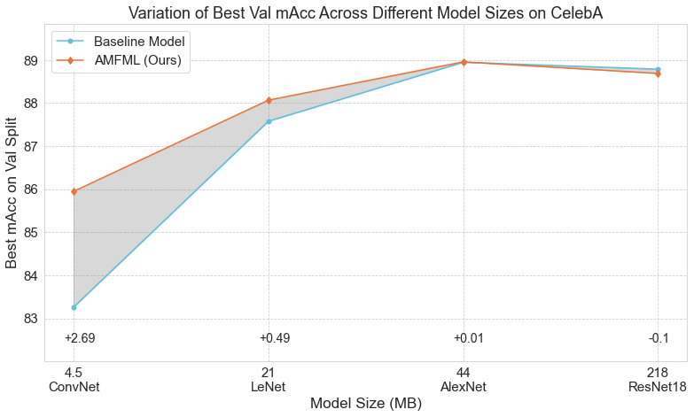

# Enriching Model Representation with Adaptive Modulated Features for Multitask Learning

This repository is final project for CS330 Meta Learning of Stanford University. Team members are Xinglong Sun and Yibo Zhang.

## Prerequisites
### Datasets
For CelebA, please follow instruction here:\
https://www.kaggle.com/datasets/jessicali9530/celeba-dataset OR
https://mmlab.ie.cuhk.edu.hk/projects/CelebA.html \
Notice that the expected files for CelebA are:

identity_CelebA.txt;    list_eval_partition.txt;
img_align_celeba;      list_landmarks_align_celeba.txt;
list_attr_celeba.txt;  list_landmarks_celeba.txt;
list_bbox_celeba.txt;

Kaggle would download the txt files in csv formats which need to transformed to txt. We suggest using the offical download link.

For NYU-V2, please download here:\
https://drive.google.com/file/d/11pWuQXMFBNMIIB4VYMzi9RPE-nMOBU8g/view


## File Description && How to run Code

### CelebA
All files are in Facial_Attributes_MTL_Baseline folder.
The files with postfix "_modulated" or "_afrm" are for our methods while the other are utility files or baseline codes. Examples commands are provided in command.sh of the folder and also below:

To get the baseline ConvNet:
```
python3 train.py --gpu 0 --filename 9tasks_convnet_cosine --model convnet --lr 0.01 --nepoch 15 --lr-scheduler cosine > 9tasks_convnet_cosine.txt &
```
To get the AMFML (Ours) ConvNet:
```
python3 train_afrm.py --gpu 1 --filename 9tasks_convnet_cosine_afrm --model convnet --lr 0.01 --nepoch 15 --lr-scheduler cosine > 9tasks_convnet_cosine_afrm.txt &
```

### NYU-V2
All files are in NYU-V2 folder. The files with postfix "_modulated" or "_afrm" are for our methods while the other are utility files or baseline codes. Examples commands are provided in command.sh of the folder and also below:
To get the baseline NYU-V2 DeepLab:
```
CUDA_VISIBLE_DEVICES=0 python3 train_basenet.py --dataset nyuv2 --network_name nyu_seg_sn &
```
To get the AMFML (Ours) NYU-V2 DeepLab:
```
CUDA_VISIBLE_DEVICES=1 python3 train_basenet_afrm.py --dataset nyuv2 --network_name nyu_seg_sn_afrm &
```
Run with the described regularization:
```
CUDA_VISIBLE_DEVICES=2 python3 train_basenet_afrm.py --dataset nyuv2 --network_name nyu_seg_sn_afrm_1e_m3 --afrm-reg --afrm-regcoef 0.001 &
```
## Experiment Results

<div align="center">
  
   Results on CelebA.
</div>

<div align="center">
  
   Smoothed Training Loss of NYU-V2.
</div>

<div align="center">
  
   Table Results of NYU-V2.
</div>
